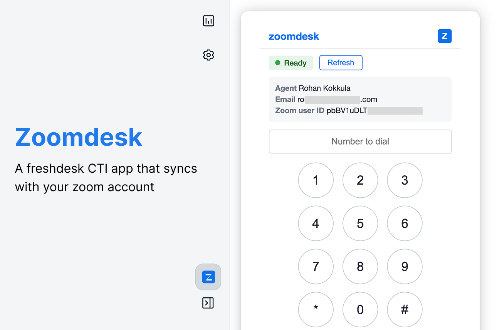

# zoomdesk (CTI tutorial — Freshdesk)

Freshdesk **CTI global sidebar** sample based on the [Freshdesk CTI tutorial](https://developers.freshworks.com/tutorials/codelabs/develop-cti-app-for-freshdesk). It loads your Zoom agent profile in the CTI pane and includes a **demo dial pad** built with **Crayons React** (`FwSpinner`, circular keys, layout).

Built on Freshworks Platform **3.0** (React Meta, Node **24.11.1**, FDK **10.1.2**).



## What this app does

| Part | Purpose |
|------|---------|
| **Agent card** | Real integration — shows name, email, and Zoom user ID from Zoom (`/users/me`) via server-side OAuth |
| **Dial pad + Call** | **UI demo only** — illustrates Crayons styling and CTI layout; does not place production calls |

## Prerequisites

- Node **24.11.1** and FDK **10.1.2**
- A Freshdesk account (for local testing with `?dev=true`)
- A Zoom account where you can create a **Server-to-Server OAuth** app

---

## Step 1 — Get the three Zoom credentials

### 1.1 Create a Server-to-Server OAuth app

1. Open [Zoom Marketplace](https://marketplace.zoom.us/) and sign in.
2. Go to **Develop** → **Build App**.
3. Choose **Server-to-Server OAuth** → **Create**.
4. Enter an app name (e.g. `zoomdesk-dev`) and complete the basic info.

### 1.2 Add the required scope

1. In the app, open **Scopes**.
2. Click **Add Scopes**.
3. Add **`user:read:admin`** (under Users).
4. Save.

### 1.3 Activate the app on your account

1. Open **Activation**.
2. Click **Activate** for your Zoom account (account admin may be required).

### 1.4 Copy Account ID, Client ID, and Client Secret

1. Open **App Credentials** (or **Basic Information** → credentials section).
2. Copy and store these three values — you will paste them into Freshdesk developer settings:

| Credential | Where it appears |
|------------|------------------|
| **Account ID** | App Credentials page |
| **Client ID** | App Credentials page |
| **Client Secret** | App Credentials page (shown once; regenerate if lost) |

Keep the **Client Secret** private. Do not commit it to git.

---

## Step 2 — Run the app locally

From the app folder:

```bash
cd only-migration/cti-tutorial-freshdesk
npm install
fdk validate
fdk run
```

Leave `fdk run` running. Note the local URLs printed in the terminal (typically `http://localhost:10001`).

---

## Step 3 — Add credentials in developer settings

While `fdk run` is active, configure installation parameters for your dev account.

### Option A — Custom configs (recommended for `fdk run`)

1. Open **http://localhost:10001/custom_configs** in your browser.
2. Enter:

   | Field | Value |
   |-------|--------|
   | Zoom Account ID | From Step 1.4 |
   | Zoom Client ID | From Step 1.4 |
   | Zoom Client Secret | From Step 1.4 |

3. Save.

### Option B — System settings

1. Open **http://localhost:10001/system_settings**.
2. Set the same three Zoom fields if shown for your product.
3. Save.

---

## Step 4 — Open the app in Freshdesk

1. Open your Freshdesk site with the dev flag, for example:  
   `https://yourdomain.freshdesk.com/a/` → add **`?dev=true`**  
   (use **`&dev=true`** if the URL already has query parameters).
2. When the browser asks to allow **local network** access, allow it (required for `fdk run`).
3. Click the **CTI** headset strip and select the blue **Z** (zoomdesk) icon.
4. Confirm the **Agent** card shows your Zoom name and email after a few seconds.
5. Use **Refresh** if you changed credentials.

The **dial pad** and **Call** button are for trying the UI only. They are not documented as a supported calling integration.

---

## Troubleshooting

| Symptom | What to check |
|---------|----------------|
| Agent card empty or error | All three fields saved in custom configs; S2S app **activated**; scope `user:read:admin` added |
| App does not load in Freshdesk | `fdk run` still running; `?dev=true` on URL; local network allowed |
| Invalid Client Secret | Regenerate secret in Zoom App Credentials and update custom configs |

---

## Project layout

```
cti-tutorial-freshdesk/
├── app/
│   ├── components/   CtiMain.jsx, ZoomdeskApp.jsx
│   ├── utils/        phone.js (demo dial helper)
│   ├── icon.svg
│   └── styles/       style.css, zoom-banner.png
├── config/           iparams.json, requests.json
├── server/           server.js (getAgent)
├── manifest.json
├── README.md
└── usecase.md
```

## Validation

```bash
fdk validate
```

Target: **0 platform errors**, **0 lint errors**.
